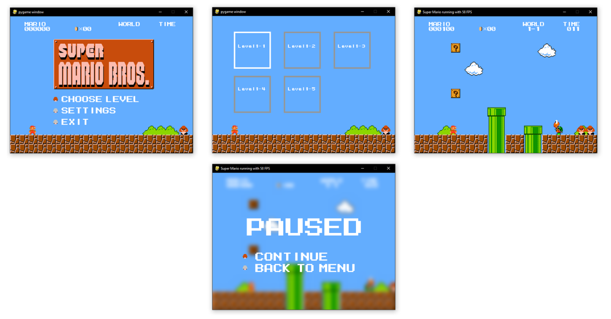

# Super Mario Implementation in Python

This is inspired by Meth-Meth-Method's [super mario game](https://github.com/meth-meth-method/super-mario/)

## Running

* $ pip install -r requirements.txt
* $ python main.py

## RL-ready environment

This fork also exposes the game as a Gymnasium-style environment without menus,
keyboard controls, pause screens, or blocking death animations.

* $ python run_random_rl_env.py
* $ python run_random_rl_env.py --human

Use `SuperMarioPythonEnv` from `rl_env.py` in training code:

```python
from rl_env import SuperMarioPythonEnv

env = SuperMarioPythonEnv(render_mode="rgb_array", frame_skip=4)
obs, info = env.reset()

obs, reward, terminated, truncated, info = env.step(env.action_space.sample())
env.close()
```

The action space is discrete and maps to `NOOP`, left/right movement, jump, and
run+jump combinations. Observations are normalized vector states with shape
`(46,)`, including Mario state, the previous action, nearby solid tiles, and the
nearest mobs. `render()` still returns RGB frames in `rgb_array` mode. The reward
primarily favors rightward progress. Score rewards, including enemy points, are
intentionally small to reduce reward farming.

## Deep Q-Learning

`dqn_train.py` trains a TensorFlow DQN agent with replay buffer,
epsilon-greedy exploration, a target network, and the Q-learning update.
Each run creates a new folder with one CSV log, config files, and saved model
weights every `--save-every` episodes. TensorFlow checkpoints are not used.

* $ python dqn_train.py --episodes 100 --save-every 10
* $ python dqn_train.py --episodes 5 --max-steps 200 --warmup-steps 50
* $ python dqn_train.py --render-mode human --fps 120 --frame-skip 8

Default outputs:

* `training_runs/dqn_YYYYMMDD_HHMMSS/training_log.csv`
* `training_runs/dqn_YYYYMMDD_HHMMSS/config.json`
* `training_runs/dqn_YYYYMMDD_HHMMSS/actions.json`
* `training_runs/dqn_YYYYMMDD_HHMMSS/models/`

Play a trained model:

* $ python dqn_play.py training_runs/dqn_YYYYMMDD_HHMMSS
* $ python dqn_play.py training_runs/dqn_YYYYMMDD_HHMMSS --epsilon 0.05
* $ python dqn_play.py training_runs/dqn_YYYYMMDD_HHMMSS --fps 120 --frame-skip 8

## Standalone windows build

* $ pip install py2exe
* $ python compile.py py2exe

## Controls

* Left: Move left  
* Right: Move right  
* Space: Jump  
* Shift: Boost   
* Left/Right Mouseclick: secret   

## Current state:


## Dependencies	
* pygame	
* scipy	

## Contribution

If you have any Improvements/Ideas/Refactors feel free to contact me or make a Pull Request.
The code needs still alot of refactoring as it is right now, so I appreciate any kind of Contribution.
